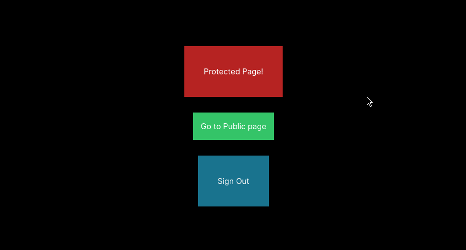

## Next.js + Clerk + Next-Intl

This project is a showcase for an issue I'm facing with Next.js, Clerk and Next-Intl.

### The issue

When using Clerk and Next-Intl together, the sign out from Clerk is not working as expected. After signing out I get an error:

```
NotFoundError: Failed to execute 'removeChild' on 'Node': The node to be removed is not a child of this node.
```


